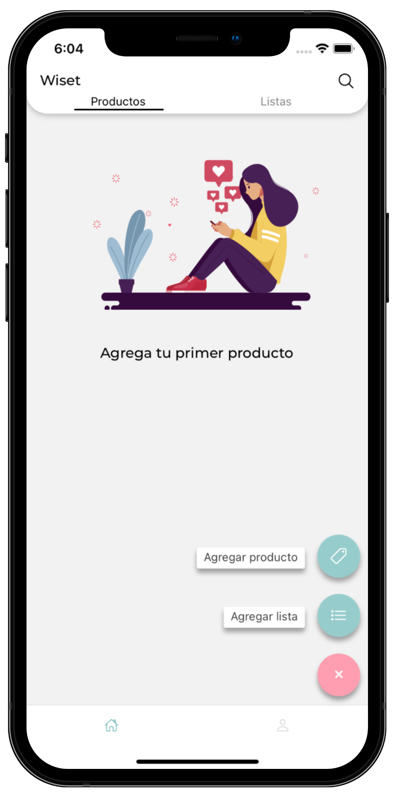
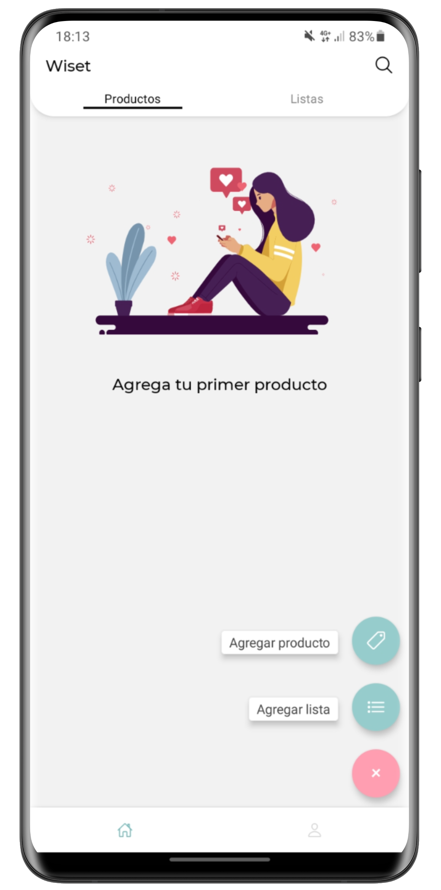

## Hi there, I'm Leandro 👋🏼

<table align="right">
 <tr><td><a href="README.md"> English</a></td></tr>
 <tr><td><a href="README_es.md"> Español</a></td></tr>
</table>

<em>Growth Engineer at <a href="https://producthackers.com/es/?utm_source=mail&utm_medium=gmail&utm_campaign=firma&utm_term=leandro">Product Hackers</a></em>

## 🤖 About me

🛠️ &nbsp; &nbsp; Coding since 2015 with 6+ years of experience in enterprise wide software development.\
✈️ &nbsp; &nbsp; Born in Argentina, currently living in Mallorca, Spain.\
📱 &nbsp; &nbsp; I have a passion for mobile development and I'm always looking for new challenges.\
🏠 &nbsp; &nbsp; I'm a big fan of IOT and I love to make my home smarter every day.\
📝 &nbsp; &nbsp; Sometimes I write technical blogs and articles on my [webpage](https://gartnerleandro.es).\
⭐️ &nbsp; &nbsp; In my free time I work on my personal project called Wiset, you can check it out [here](https://wiset.es/en).\
🐶 &nbsp; &nbsp; I love to spending time with my dogs.

  
More about my dogs
&nbsp;

  &nbsp;

  &nbsp;

  

&nbsp;

## 🔝 Top used languages

## 🚀 Featured projects

## ✨ Wiset project

